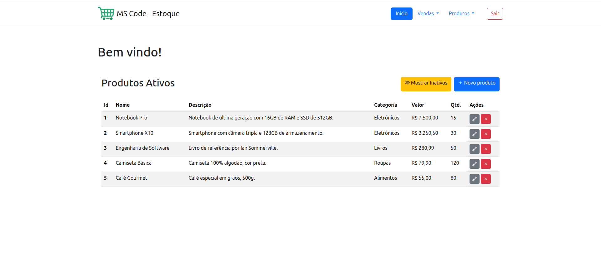

# Projeto realizado durante as aulas do curso MSCODE fornecido pela Moveis Simonetti.

O projeto atual é um WebApp de gerenciamento de estoque que tem funcionalidades:

- Adicionar, editar e desativar produtos.
- Criar e editar vendas.
- Criar, editar e excluir categorias.
- Sistema de login.

**Em breve novas funções serão adicionadas ao projeto!**

## Abaixo prints com as telas do app

### **Tela de login**

### **Tela de registro**

### **Tela inicial com ativos**

### **Tela inicial com inativos**

### **Tela criar produto**

### **Tela editar produto**

### **Tela categorias**

### **Tela criar categorias**

### **Tela editar categorias**

### **Tela vendas**

### **Tela nova venda**

### **Tela editar venda**
